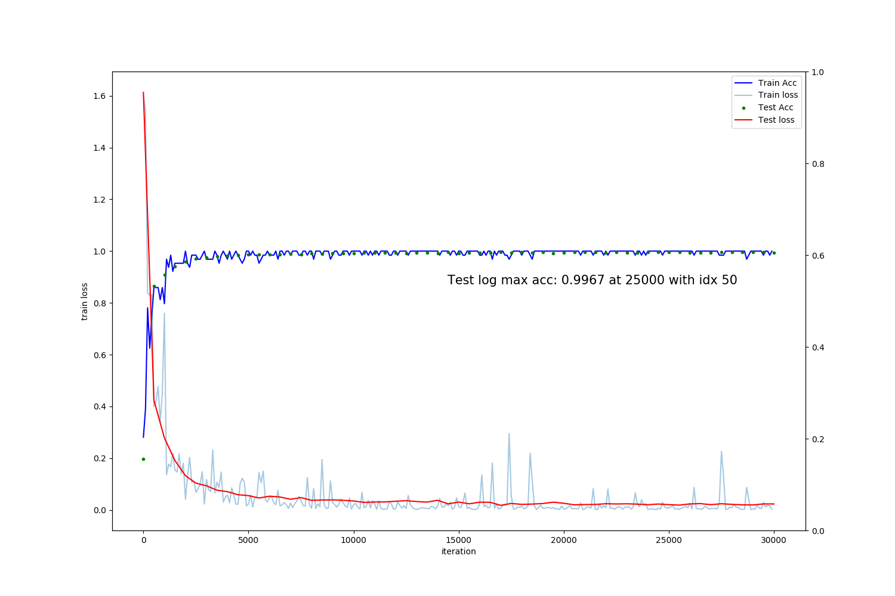

# ITMS Classifier with CAFFE
ITMS Classification 
Inference test with caffe model

```angular2html
dependencies: py3.6-pytorch1.2-caffe-gpu.yml
- caffenet.py
- prototxt.py
- detection.py
```
# usage
```angular2html
python infer_caffe_with_pyTorch.py --protxt ...

```
# update
- 20200328: 5 classes results in 99.67% acc at 25000 with 0.001 lr 

 
